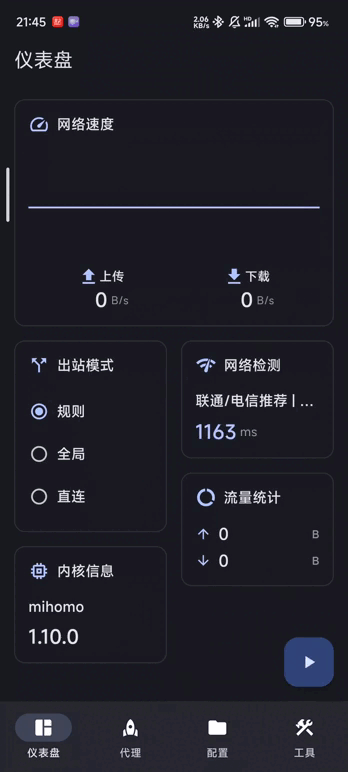

<div>

[**简体中文**](README_zh_CN.md)

</div>

## Panorama Secure Access

[](https://github.com/WENSHAO521/panorama-secure-access/releases/)[](https://github.com/WENSHAO521/panorama-secure-access/releases/)[](LICENSE)

A multi-platform proxy client based on ClashMeta, simple and easy to use, open-source and ad-free. A rebranded fork
of [FlClash](https://github.com/chen08209/FlClash) — see [License & Credits](#license--credits).

## Disclaimer

This software (Panorama Secure Access) is produced by **Panorama Scholarly Group** for internal testing and educational use only, and is not intended for any commercial use or public distribution. The software is provided "AS IS", without warranty of any kind, express or implied. Users are solely responsible for any risks and legal liabilities arising from their use of this software, and must ensure such use complies with all applicable local laws and regulations. Panorama Scholarly Group and its developers assume no liability for any direct or indirect damages resulting from the use, or inability to use, this software.

on Desktop:
<p style="text-align: center;">
    
</p>

on Mobile:
<p style="text-align: center;">
    
</p>

## Features

✈️ Multi-platform: Android, Windows, macOS and Linux

💻 Adaptive multiple screen sizes, Multiple color themes available

💡 Based on Material You Design, [Surfboard](https://github.com/getsurfboard/surfboard)-like UI

☁️ Supports data sync via WebDAV

✨ Support subscription link, Dark mode

## Use

### Linux

⚠️ Make sure to install the following dependencies before using them

   ```bash
    sudo apt-get install libayatana-appindicator3-dev
    sudo apt-get install libkeybinder-3.0-dev
   ```

### Android

Support the following actions

   ```bash
    com.follow.clash.action.START
    
    com.follow.clash.action.STOP
    
    com.follow.clash.action.TOGGLE
   ```

## Download

<a href="https://github.com/WENSHAO521/panorama-secure-access/releases"></a>

### Homebrew

```bash
brew tap chen08209/tap
brew install --cask flclash
```

## Build

1. Update submodules
   ```bash
   git submodule update --init --recursive
   ```

2. Install `Flutter` and `Golang` environment

3. Build Application

    - android

        1. Install `Android SDK`, `Android NDK`

        2. Set `ANDROID_NDK` environment variable

        3. Run build script

           ```bash
           dart setup.dart android
           ```

    - windows

        1. Requires a Windows client

        2. Install `GCC`, `Inno Setup`

        3. Run build script

           ```bash
           dart setup.dart windows
           ```

    - linux

        1. Requires a Linux client

        2. Dependencies are auto-installed by setup script, or manually:
           ```bash
           sudo apt-get install -y libayatana-appindicator3-dev libkeybinder-3.0-dev
           ```

        3. Run build script

           ```bash
           dart setup.dart linux
           ```

    - macOS

        1. Requires a macOS client

        2. Run build script

           ```bash
           dart setup.dart macos
           ```

## License & Credits

Panorama Secure Access is a rebranded, modified fork of [FlClash](https://github.com/chen08209/FlClash) by chen08209,
itself built on [Clash.Meta / mihomo](https://github.com/MetaCubeX/mihomo). The original project and this fork are
both licensed under the [GNU General Public License v3.0](LICENSE); as a derivative of GPL-3.0 code, this fork
remains under GPL-3.0. Modifications in this fork (rebranding, icons, default theme, disclaimer) are
© Panorama Scholarly Group, distributed under the same license.

## Star

The easiest way to support developers is to click on the star (⭐) at the top of the page.

<p style="text-align: center;">
    <a href="https://api.star-history.com/svg?repos=WENSHAO521/panorama-secure-access&Date">
        
    </a>
</p>
